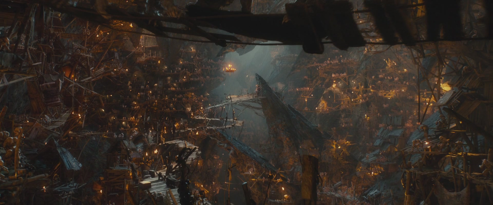

# Goblin Movie Recommender
The head of the regional board of goblins (Jeny), expressed that in a national poll of goblins 100% of goblins felt that their Goblinflix recommendations were innacurrate. Our team was contracted with improving goblin recommendations by using goblin rating data. The data comes from far far away and was recently delivered by an Ogre. For any goblins here today who need a translator know that we have none and have no intentions of getting one after the last Goblin translator ate our cat. Please do not eat any Cats during todays presentation.

# Data and EDA

# Algorithm functionality
We attempted several algorithms to create a new recommendation system. The first was using ALS and worked by....

We looked through the genre tags that were within the tags.csv file and noticed around 10 were showing up consistently, so for our latent factors for our ALS model, we chose 10.

We also ended up using a regularization parameter of .1 to make sure no latent topics would be over valued in our model.
With all of this in mind, we ended up getting a RMSE value of .88

The Second algorithm is kinda funky. Funk SVD uses a system of rounds that start off with a very poor model for predicting Goblin title ratings and then gradually improves them until it reaches peak efficiency.

| Method | Global Mean | Mean of Means | SVD |ALS|
|-----------------------------|-------------|---------------|------|---|
| Avg Root Mean Squared Error | 1.13 | 1.08 | .937 | .887|

This is the user recemmondation list for user 472:
|Mean of Means||ALS|
|:---:|---|:---:|
|Forrest Gump (1957)|l|An Affair to Remember (1957)|
|Circle of Friends (1946)|l|The Best Years of Our Lives (1946)|
|Meet Me in St. Louis (1926)|l|The General (1926)|
|Fly Away Home (1994)|l|Shallow Grave (1994)|
|House Party 3 (1976)|l|The Big Bus (1976)|

# Conclusion
The current baseline model focuses only on numbers without understanding what they actually mean. If you want to deliver personalized goblin content to your customers you need to be able to understand what each customer wants. While that would take an insane amount of work for a person, our recommender system can clearly handle it in a flash. By building upon the baseline system you're already using and adding on a model that finds the hidden topics and trends we can help you deliver the content each of your customers craves. Probably cats?