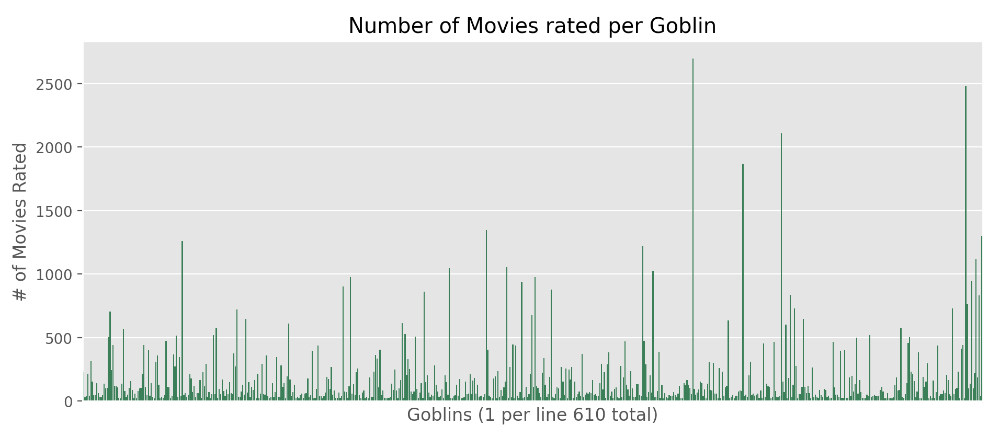
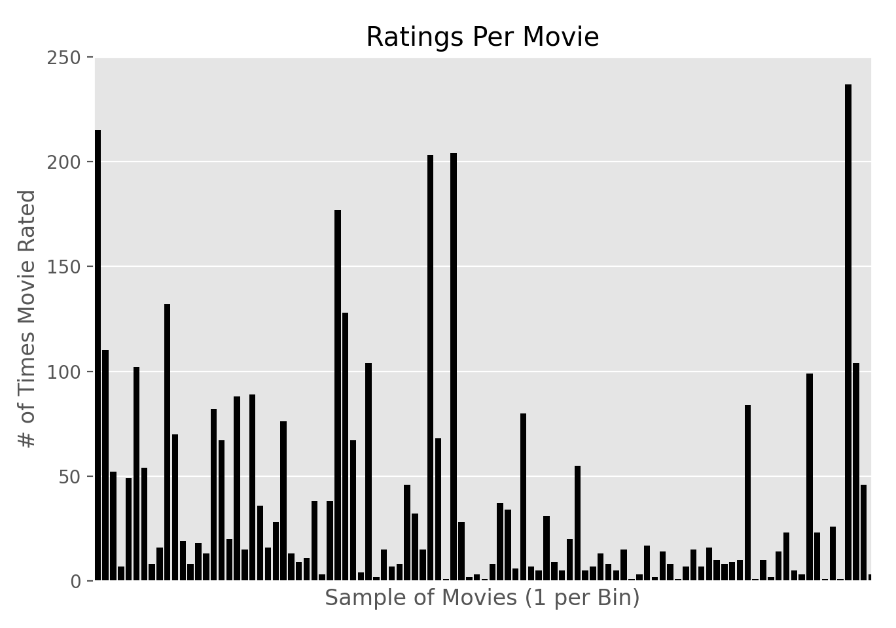
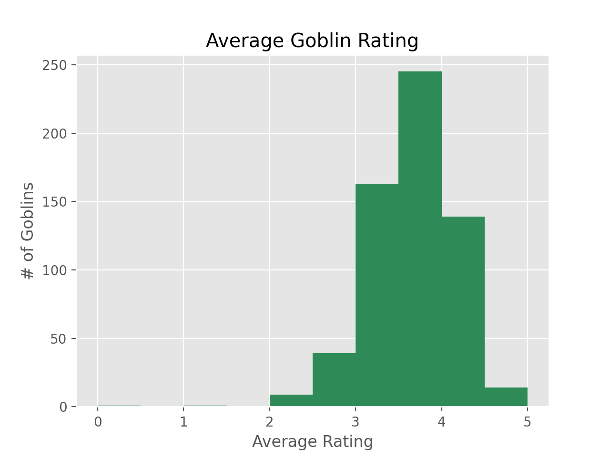

# Goblin Movie Recommender
The head of the regional board of goblins (Jenny), expressed that in a national poll of goblins 100% of goblins felt that their Goblinflix recommendations were innacurrate. Our team was contracted with improving goblin recommendations by using goblin rating data. The data comes from far far away and was recently delivered by an Ogre. For any goblins here today who need a translator know that we have none and have no intentions of getting one after the last Goblin translator ate our cat. Please do not eat any Cats during todays presentation.

# EDA

<<<<<<< HEAD
The graph above shows the distribution of the number of movies rated by each individual user. As you can see there are some outliers. 

=======
The above graph shows us that there are inconsistencies within goblin population regarding movies rated. Some super users have rated over 2,500 movies.

  
>>>>>>> c30d096272c78908908cd45f0d6023ee2347d985

The ratings per movie are similar to the ratings per goblin. There are a few large outliers but the majority have only a few ratings. 
This raises it's own issues, while the outliers have a soundly averaged value in the baseline model the majority of films are working off a much smaller number of samples which can give innacurate impressions. If a certain movie is only watched by people who like it its average will be high even though it only appeals to a small number of goblins.

  

Because the average rating per user is about the same we have less to worry about with regards to the movie rating discrepancies noticed above. The original algorithm that the goblins used would apply mean ratings to movies in order to suggest a movie. This wouldn't work very well because the average is so strongly weighted to a positive range, essetially it just recommends everything. For this reason a new algorithm would need to look at things a bit differently.

# Algorithm functionality

| Method | Global Mean | Mean of Means | SVD |ALS|
|-----------------------------|-------------|---------------|------|---|
| Avg Root Mean Squared Error | 1.13 | 1.08 | .937 | .887|

The goal was to be accurate to our assumptions on user preference based on explicit choice.
Therefore achieving a low RMSE indicates success.
We started off with looking at an ALS alogrithm through spark modules to see if we could get a lower RMSE value than the baseline global mean and mean of means RMSE.

ALS splits the test matrix into a user & item matrix giving us two n,m matrixes.
Setting matrix 1 to a fixed point(constant) and optimizing matrix 2. And multiplying them giving 
the prediction matrix, compare it to the original. And detrmine how far off the newly transformed matrix
is to our original matrix.

We looked through the genre tags that were within the tags.csv file and noticed around 10 were showing up consistently, so for our latent factors for our ALS model, we chose 10.

We also ended up using a regularization parameter of .1 to make sure no latent topics would be over valued in our model.
With all of this in mind, we ended up getting a RMSE value of .88

This is the user recemmondation list for user 472:
|Mean of Means||ALS|
|:---:|---|:---:|
|Forrest Gump (1994)|l|An Affair to Remember (1957)|
|Circle of Friends (1995)|l|The Best Years of Our Lives (1946)|
|Meet Me in St. Louis (1944)|l|The General (1926)|
|Fly Away Home (1996)|l|Shallow Grave (1994)|
|House Party 3 (1994) |l|The Big Bus (1976)|

# Conclusion
The current baseline model focuses only on numbers without understanding what they actually mean. If you want to deliver personalized goblin content to your customers you need to be able to understand what each customer wants. While that would take an insane amount of work for a person, our recommender system can clearly handle it in a flash. By building upon the baseline system you're already using and adding on a model that finds the hidden topics and trends we can help you deliver the content each of your customers craves. Probably cats?